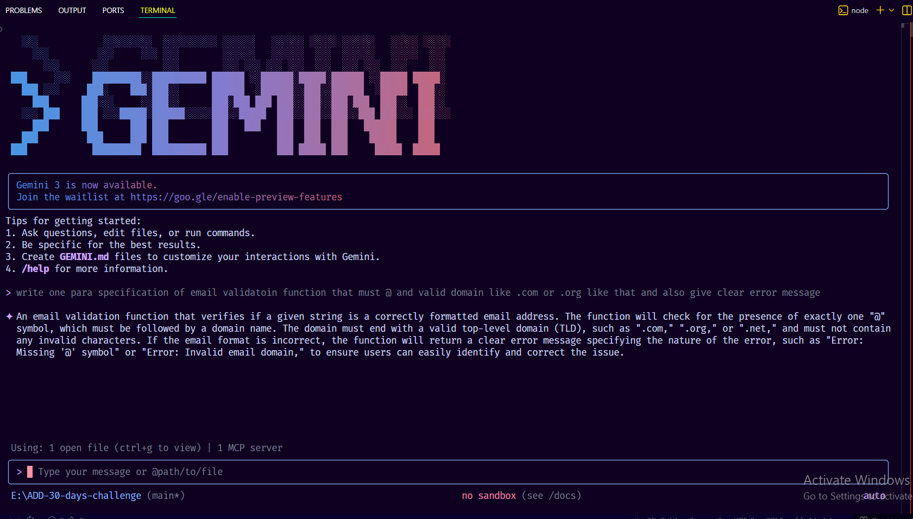

# AIDD Questions & Answers

## 1. Nine Pillars Understanding

**Question:** Why is using AI Development Agents (like Gemini CLI) for repetitive setup tasks better for your growth as a system architect? Explain how the Nine Pillars of AIDD help a developer grow into an M-Shaped Developer.

**Answer:**

**Nine Pillars of AIDD:**
- Specification-Driven, AI-Augmented, Agent-Orchestrated
- Quality-Gated, Version-Controlled, Human-Verified
- Iteratively-Refined, Documentation-Embedded, Production-Ready

**Why AI agents are better for growth:**
- AI handles boring setup work → You focus on architecture and design
- Less time debugging syntax → More time understanding systems
- Example: Instead of 6 hours fixing bugs, spend 6 hours designing payment workflows
- You learn at a higher level, not just syntax

**Growing into M-Shaped Developer:**
- AI handles implementation → You explore multiple domains faster
- Build depth in: specification writing, architecture design, system validation
- Build breadth across: Python, TypeScript, DevOps, databases
- You architect systems instead of just writing code

---

## 2. Vibe Coding vs Specification-Driven Development

**Question:** Why does Vibe Coding usually create problems after one week? How would Specification-Driven Development prevent those problems?

**Answer:**

**Vibe Coding problems (after 1 week):**
- Files scattered everywhere, no structure
- Can't understand your own code
- Hidden bugs and missing edge cases
- Zero documentation
- Fast today = nightmare tomorrow

**Specification-Driven Development prevents this:**
- Write clear requirements FIRST before coding
- Define system structure and quality standards upfront
- AI generates organized, consistent code from your spec
- Creates intentional architecture, not accidental chaos
- Maintainable from day one

**Key difference:**
- Vibe: "Build me a to-do app" → Instant mess
- Spec-Driven: Plan → Specify → Generate → Validate → Clean system

---

## 3. Architecture Thinking

**Question:** How does architecture-first thinking change the role of a developer in AIDD? Explain why developers must think in layers and systems instead of raw code.

**Answer:**

**Role transformation:**
- From: Code writer (80% coding, 20% design)
- To: System architect (20% specs, 80% oversight)
- You become a mentor to AI agents, not a code typist
- Focus: Design decisions, validation, architecture

**Three layers to understand:**
1. **Intent Layer** - Your specifications (what you want)
2. **Reasoning Layer** - AI logic in Python (how it thinks)
3. **Interaction Layer** - Frontend in TypeScript (what users see)

**Why think in systems, not raw code:**
- Understand how data flows through your app
- Know which components depend on each other
- Design for scalability and failure handling
- Create maintainable systems, not tangled code

**Bottom line:**
- AI writes excellent functions
- Humans design how functions work together
- System thinking = long-term success
- Raw coding skills alone = not enough anymore

# Practicle Section

# MCQs

| # | Question | Correct Answer |
|---|----------|----------------|
| **1** | **What is the main purpose of Spec-Driven Development?** A. Make coding faster B. Clear requirements before coding begins C. Remove developers D. Avoid documentation | **B. Clear requirements before coding begins** |
| **2** | **What is the biggest mindset shift in AI-Driven Development?** A. Writing more code manually B. Thinking in systems and clear instructions C. Memorizing more syntax D. Working without any tools | **B. Thinking in systems and clear instructions** |
| **3** | **Biggest failure of Vibe Coding?** A. AI stops responding B. Architecture becomes hard to extend C. Code runs slow D. Fewer comments written | **B. Architecture becomes hard to extend** |
| **4** | **Main advantage of using AI CLI agents (like Gemini CLI)?** A. They replace the developer completely B. Handle repetitive tasks so dev focuses on design & problem-solving C. Make coding faster but less reliable D. Make coding optional | **B. Handle repetitive tasks so dev focuses on design & problem-solving** |
| **5** | **What defines an M-Shaped Developer?** A. Knows little about everything B. Deep in only one field C. Deep skills in multiple related domains D. Works without AI tools | **C. Deep skills in multiple related domains** |
