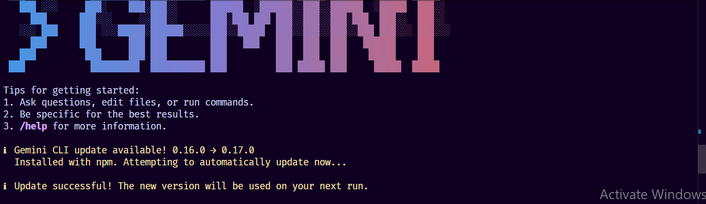

## Gemini 3.0: Key Improvements & Capabilities

### 1. What new improvements were introduced in Gemini 3.0?

Gemini 3.0 brings major upgrades across the board. Reasoning got a big boost, with the model scoring 72.1% on SimpleQA Verified for factual accuracy. Multimodal processing is now native rather than stitched together, hitting 81% on MMMU-Pro. Coding capabilities improved dramatically with 76.2% on SWE-bench Verified. The model also handles long-horizon planning better, maintaining coherent decisions over extended tasks.

### 2. How does Gemini 3.0 improve coding & automation workflows?

The model excels at "vibe coding," where you give it a rough concept and it generates a full runnable project scaffold. Multi-step tasks stay coherent instead of falling apart halfway through. Tool use improved significantly, with the model able to execute complex terminal workflows autonomously. The 1 million-token context window helps it keep track of project requirements across long sessions.

### 3. How does Gemini 3.0 improve multimodal understanding?

Rather than processing different formats separately, Gemini 3.0 handles text, images, audio, and video natively all at once. Vision and spatial reasoning improved, so it can read fine text in images and catch small details. In real-world testing, it accurately transcribed 3-hour multilingual meetings and extracted data from poor-quality document photos, outperforming previous models by over 50%.

### 4. Name any two developer tools introduced with Gemini 3.0

**Google Antigravity** – An AI-powered IDE where agents can directly access the editor, terminal, and browser to plan and execute complex tasks autonomously.

**Jules API** – A scriptable API for Google's coding agent that lets developers integrate autonomous coding into their CI/CD pipelines and custom workflows.

